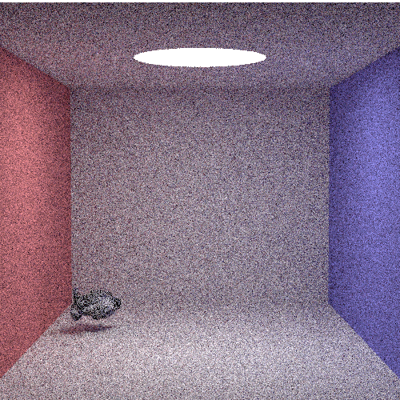

haskell-smallpt
===

> Haskell implementation for "smallpt" (small path tracing). The code is written for read clarity, so it is a little longer than the original C version.

## Usage

```shell
$ cabal install --only-dependencies
$ cabal configure
$ cabal build
$ cabal run [width] [height] [samples]
```

## Result



(800 x 600, 128 samples per pixel)

## License

MIT License 2015 (c) tatsy, Tatsuya Yatagawa
